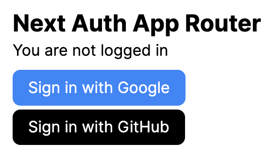
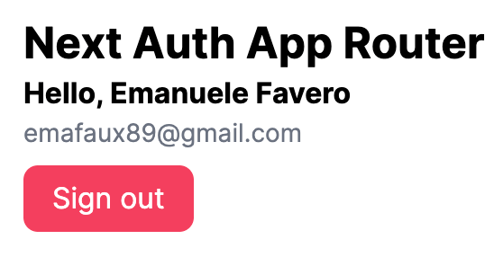

# NextAuth App Router Authentication

This is an example of how to implement authentication with NextAuth in Next.js App Router

### Screenshots

##### Sign In



##### Sign Out



## Getting Started

- Clone the repository
- Add `.env.local` file with the following content:

```bash
AUTH_GITHUB_ID=
AUTH_GITHUB_SECRET=
AUTH_GOOGLE_ID=
AUTH_GOOGLE_SECRET=
AUTH_SECRET= # a random string, see .env.example for instructions
```

> To get the `AUTH_GITHUB_ID` and `AUTH_GITHUB_SECRET` you need to create a new OAuth App in your GitHub account. Follow this guide: [GitHub NextAuth](https://www.youtube.com/watch?v=v2u8EDGFVpo)
>
> To get the `AUTH_GOOGLE_ID` and `AUTH_GOOGLE_SECRET` you need to create a new OAuth App in your Google account. Follow this guide: [Google NextAuth](https://www.youtube.com/watch?v=A53T9_V8aFk)
>
> BEWARE: Use these URLs as the callback URLs during configuration (the ones in the videos could be different):
>
> - `http://localhost:3000/api/auth/callback/github`
> - `http://localhost:3000/api/auth/callback/google`

- Run:

```bash
npm i
npm run dev
```

Open [http://localhost:3000](http://localhost:3000) with your browser to see the result

## Resources

- [Next.js Authentication](https://nextjs.org/docs/app/building-your-application/authentication)
- [NextAuth](https://next-auth.js.org/)
- [Lucia Auth](https://lucia-auth.com/)

## License

- [MIT](LICENSE.md)
